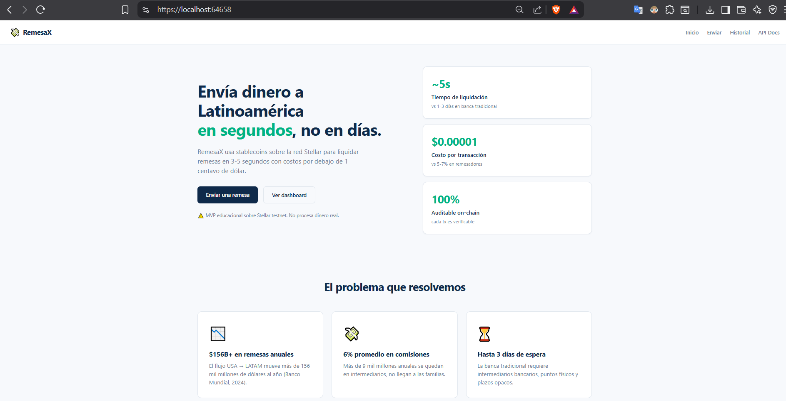
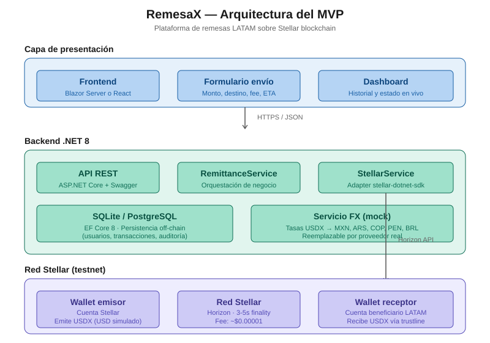
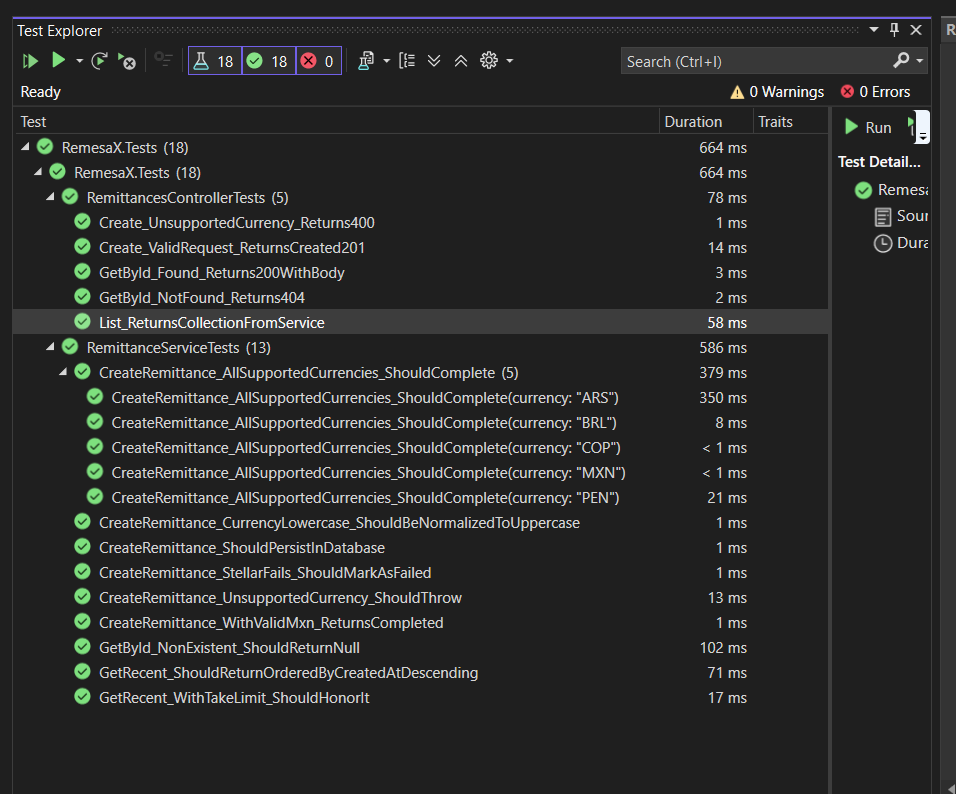
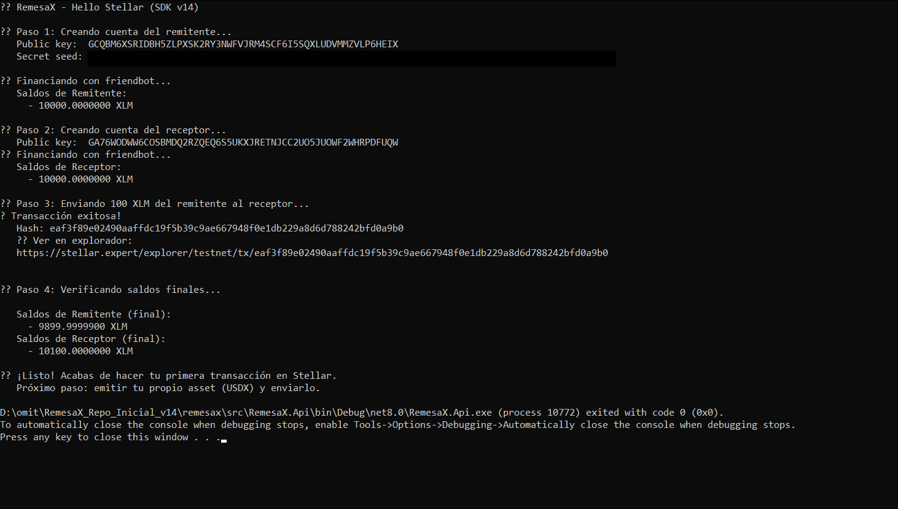
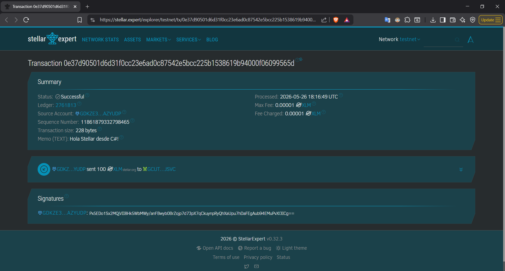
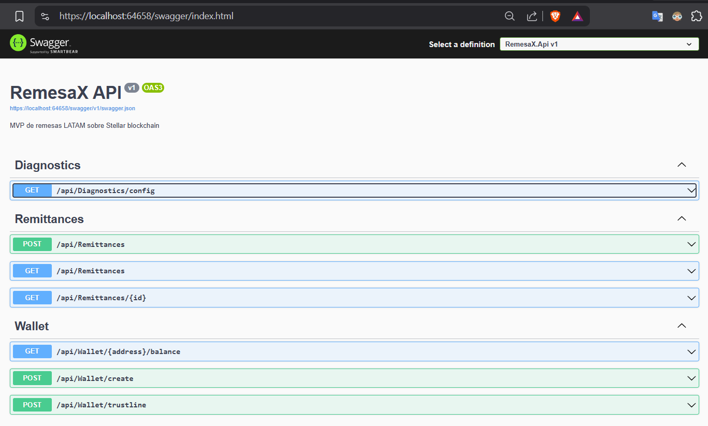
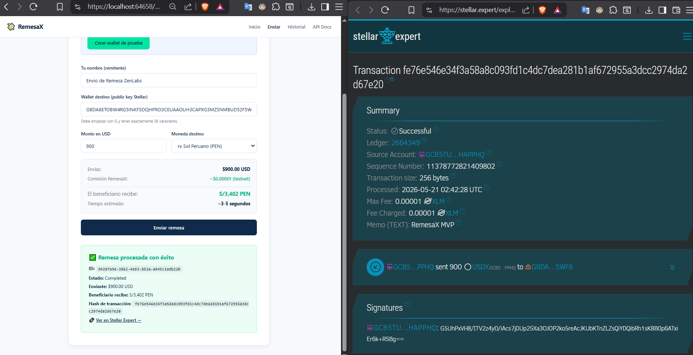
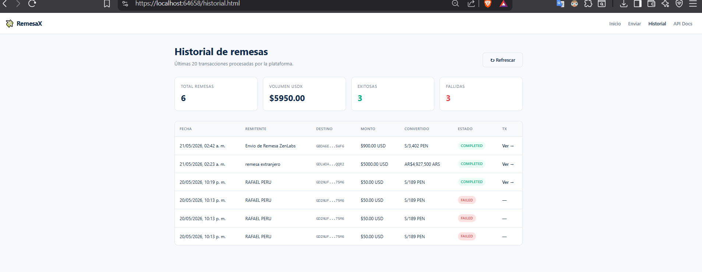

<div align="center">

# 💸 RemesaX

### Plataforma MVP de remesas LATAM sobre Stellar blockchain

**Envía dinero a Latinoamérica en segundos por menos de un centavo, usando stablecoins.**

[](https://dotnet.microsoft.com/)
[](https://stellar.org/)
[](https://github.com/Beans-BV/dotnet-stellar-sdk)
[](LICENSE)
[]()
[](https://github.com/TU_USUARIO/remesax/actions)

[**Demo en vivo**](https://remesax.fly.dev) · [**API Docs**](https://remesax.fly.dev/swagger) · [**Decisiones técnicas**](#-decisiones-arquitectónicas) · [**Roadmap**](#-roadmap)

</div>

---

## 🎬 Demo



> ⚠️ **Disclaimer:** MVP educacional sobre Stellar **testnet**. No procesa dinero real ni reemplaza a un proveedor regulado.

---

## 🎯 El problema

Las remesas de Estados Unidos hacia Latinoamérica superan los **$156 mil millones anuales** (Banco Mundial, 2024). El costo promedio de enviar $200 ronda el **6%**, lo que significa que más de **$9 mil millones al año** se quedan en comisiones que no llegan a las familias.

Los proveedores tradicionales tardan **horas a días**, requieren puntos físicos de retiro y aplican spreads cambiarios opacos.

## 💡 La solución

| Métrica | Banca tradicional | RemesaX |
|---|---|---|
| **Tiempo de liquidación** | 1-3 días | **3-5 segundos** |
| **Costo por transacción** | 5-7% del monto | **~$0.00001** |
| **Auditabilidad** | Opaca | **100% on-chain** |
| **Intermediarios** | Banco corresponsal, MoneyGram, etc. | **Ninguno** |

---

## 🏗️ Arquitectura



**Tres capas separadas:**

1. **Presentación** — Frontend HTML+JS servido por la misma API
2. **Aplicación** — API REST en .NET 8, lógica de negocio, persistencia
3. **Blockchain** — Stellar testnet (cuentas, assets, trustlines, pagos)

### Estructura del repositorio

```
remesax/
├── src/
│   ├── RemesaX.Api/              # ASP.NET Core 8 Web API + frontend wwwroot
│   ├── RemesaX.Core/             # Entidades, DTOs, interfaces (sin dependencias)
│   ├── RemesaX.Infrastructure/   # Stellar adapter, EF Core, implementaciones
│   └── RemesaX.Tests/            # xUnit + Moq + FluentAssertions
├── docs/                          # Diagramas y screenshots
├── scripts/                       # HelloStellar.cs, EmitirUSDX.cs (aprendizaje)
├── docker-compose.yml             # Despliegue local con un comando
├── Dockerfile                     # Multi-stage build
└── .github/workflows/ci.yml       # Build + tests + docker en cada push
```

---

## 🛠️ Stack técnico

| Capa | Tecnología | Por qué |
|---|---|---|
| Backend | .NET 8 + ASP.NET Core | Performance, ecosistema maduro, perfil enterprise/fintech |
| Blockchain | Stellar (testnet) | Diseñada para pagos, fees mínimas, finalidad en segundos |
| SDK | stellar-dotnet-sdk v14 | SDK oficial mantenido (Beans-BV), integración nativa |
| Persistencia | EF Core + SQLite | Simple en local, migrable a PostgreSQL en producción |
| Frontend | HTML + JS vanilla | API consumible por cualquier cliente (decoupling intencional) |
| Tests | xUnit + Moq + FluentAssertions + EFCore.InMemory | Stack estándar de testing en .NET |
| CI | GitHub Actions | Build + tests automáticos en cada push |
| Deploy | Docker + Fly.io | Reproducible y gratuito en free tier |

---

## 🤔 Decisiones arquitectónicas

### ¿Por qué Stellar y no Ethereum?

| Criterio | Stellar | Ethereum |
|---|---|---|
| **Caso de uso nativo** | Pagos y remesas | Smart contracts genéricos |
| **Costo por tx** | ~$0.00001 | $1-$20 (variable) |
| **Finalidad** | 3-5 segundos | ~12 segundos en L1 |
| **Curva de aprendizaje** | Baja (sin Solidity) | Alta (Solidity, EVM, gas) |
| **Adopción fintech** | MoneyGram, Circle, Franklin Templeton | Más DeFi, menos pagos retail |

Para un MVP de remesas, Stellar es coherente con el caso de uso. Una v2 podría agregar puentes a EVM si se requiere interoperabilidad con DeFi.

### Arquitectura limpia

- **Core** no depende de **Infrastructure** ni de **Api** (dependency inversion)
- **StellarService** es un adaptador que aísla la complejidad del SDK blockchain
- **Configuración fail-fast**: validación de secrets al arrancar, no en runtime cuando un usuario hace una llamada
- **Logging estructurado** con Serilog
- **Validación defensiva** en controllers con mensajes de error útiles

---

## 🚀 Inicio rápido

### Pre-requisitos
- .NET 8 SDK
- Docker (opcional)
- Una cuenta emisora de Stellar testnet (instrucciones abajo)

### 1. Crear cuenta emisora en Stellar testnet

```bash
# Opción A: usar el script de aprendizaje incluido
cd scripts
dotnet run --project HelloStellar.csproj
# Te imprime un par de llaves financiadas con friendbot
```

### 2. Configurar secrets

```bash
cd src/RemesaX.Api
cp appsettings.example.json appsettings.Development.json
# Editar y poner las llaves del paso 1
```

### 3. Correr localmente

```bash
# Sin Docker
dotnet restore
dotnet run --project src/RemesaX.Api

# Con Docker
docker-compose up --build
```

Abre `http://localhost:5000` → frontend
Abre `http://localhost:5000/swagger` → API docs

---

## 📋 Endpoints principales

| Método | Ruta | Descripción |
|---|---|---|
| POST | `/api/Remittances` | Crear nueva remesa (emite USDX al destino) |
| GET | `/api/Remittances/{id}` | Consultar estado |
| GET | `/api/Remittances?take=20` | Listar recientes |
| POST | `/api/Wallet/create` | Crear cuenta Stellar de testnet (friendbot) |
| POST | `/api/Wallet/trustline` | Establecer trustline a USDX |
| GET | `/api/Wallet/{address}/balance` | Saldo on-chain |
| GET | `/api/Diagnostics/config` | Validar configuración cargada |
| GET | `/health` | Health check |

---

## 🧪 Tests

```bash
dotnet test
```

Resultado esperado:
```
Passed!  - Failed: 0, Passed: 13, Skipped: 0, Total: 13
```



---

## 📸 Galería

### Primera transacción on-chain desde C#


### Transacción auditable en Stellar Expert


### API REST con OpenAPI


### Frontend con preview en tiempo real


### Dashboard con KPIs


---

## 🗺️ Roadmap

### ✅ v0.1 — MVP funcional (este repo)
- Emisión de USDX en Stellar testnet
- API REST con endpoints completos
- Frontend funcional servido por la API
- Tests unitarios + integración
- Despliegue containerizado

### 🚧 v0.2 — Compliance & UX
- [ ] Integración KYC con proveedor sandbox (Sumsub / Onfido)
- [ ] Listas de sanciones mock (OFAC)
- [ ] Límites por usuario y por transacción
- [ ] Notificaciones por email (SendGrid)

### 🔮 v0.3 — Multi-currency real
- [ ] Path payments (USDX → MXN nativo de un anchor)
- [ ] Integración con anchors regulados de Stellar (Anclap, Cowrie)
- [ ] Oráculos de FX en tiempo real

### 🌐 v1.0 — Smart contracts
- [ ] Smart contract de escrow en **Soroban** (Rust)
- [ ] Liberación condicional de fondos (validación KYC del receptor)
- [ ] Bridge cross-chain con EVM (Polygon)

### 💼 v2.0 — Enterprise
- [ ] CBDC integration mock (DREX, Peso Digital)
- [ ] Multi-tenant para corredores
- [ ] Reportes regulatorios automatizados
- [ ] Webhook system para integraciones B2B

---

## 📚 Recursos consultados

- [Stellar Developer Docs](https://developers.stellar.org)
- [stellar-dotnet-sdk (Beans-BV)](https://github.com/Beans-BV/dotnet-stellar-sdk)
- [BIS Working Paper: Tokenization and the future of money](https://www.bis.org/publ/work1178.htm)
- [World Bank: Migration and Remittances Brief 40](https://www.worldbank.org/en/topic/migrationremittancesdiasporaissues)

---

## 🎓 ¿Por qué este proyecto?

Este MVP es una **pieza de portfolio** que demuestra el cruce entre tres áreas de alto valor en el mercado:

- **Arquitectura de soluciones enterprise** (.NET 8, clean architecture)
- **Fintech** (modelo de negocio real, compliance-aware, regulado)
- **Blockchain** (no genérico — específicamente para pagos)

Cada decisión técnica está justificada desde la perspectiva de un sistema financiero real, no de un experimento blockchain genérico.

---

## 👤 Autor

**Rafael Estrada** — Arquitecto de soluciones · Fintech · Blockchain

[](https://linkedin.com/in/rafael-estrada-m)
[](https://github.com/rafaelcode)

---

## 📄 Licencia

[MIT](LICENSE) 

---

<div align="center">

⚠️ **Disclaimer:** Este es un MVP educacional sobre la red de pruebas (testnet) de Stellar. No usa dinero real, no procesa remesas reales, y no debe usarse en producción sin auditorías de seguridad, compliance KYC/AML y licencias regulatorias aplicables.

</div>
